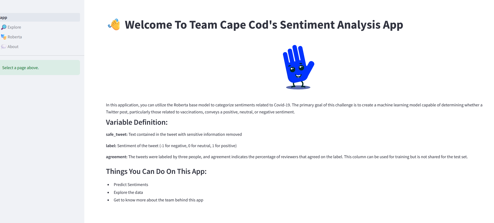
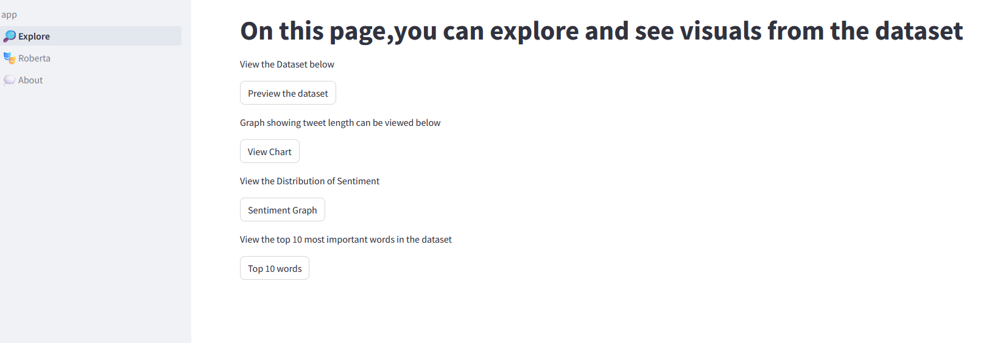
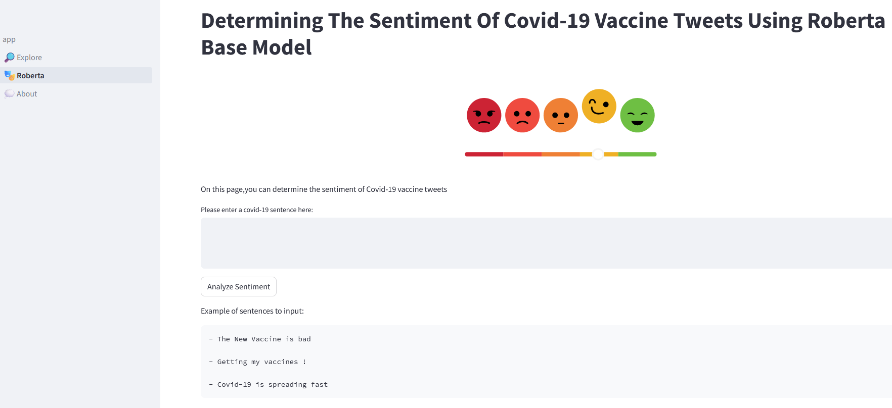

# Discovering Public Sentiment Towards COVID-19 Vaccination Through Advanced NLP and Deep Learning

## LP5 Project

# Table of Content

1. [Introduction](#introduction)
 
2. [Objective of the Project](#objective-of-the-project)

3. [Significance of the Project](#significance-of-the-project)

4. [Project Overview](#project-overview)
  
5. [Data Understanding](#data-understanding)

   5.1 [Dataset Retrieval](#dataset-retrieval)

   5.2 [Training and Test Datasets Overview](#training-and-test-datasets-overview)

   5.3 [Handling Missing Values](#handling-missing-values)

   5.4 [Checking for Duplicates](#checking-for-duplicates)

6. [Exploratory Data Analysis (EDA)](#exploratory-data-analysis-eda)

   6.1 [Sentiment Distribution Visualization](#sentiment-distribution-visualization)

   6.2 [Unique Values in the Label Class](#unique-values-in-the-label-class)

   6.3 [Tweet Length Analysis](#tweet-length-analysis)

7. [Data Preparation](#data-preparation)

   7.1 [Handling Missing Values](#handling-missing-values-1)

   7.2 [Dropping Irrelevant Columns](#dropping-irrelevant-columns)

   7.3 [NLP Preprocess Techniques](#nlp-preprocess-techniques)

   7.4 [Feature Engineering](#feature-engineering)

8. [Model Training](#model-training)

   8.1 [Model Selection](#model-selection)

   8.2 [Installation and Importation of Models](#installation-and-importation-of-models)

   8.3 [Google Colab Platform](#google-colab-platform)

   8.4 [Importation of Data from Google Drive](#importation-of-data-from-google-drive)

   8.5 [Data Splitting](#data-splitting)

   8.6 [Load Dataset](#load-dataset)

   8.7 [Tokenization](#tokenization)

   8.8 [Dealing with Imbalanced Data](#dealing-with-imbalanced-data)

   8.9 [Training Parameters](#training-parameters)

   8.10 [Training of the Fine-tuned Model](#training-of-the-fine-tuned-model)
   
9. [Evaluation](#evaluation)

10. [Model Deployment](#model-deployment)
    
11. [Conclusion](#conclusion)
  
12. [References](#references)
    

## Introduction

The Project dives into the social media space, leveraging advanced Natural Language Processing (NLP) and Deep Learning techniques to decode sentiments embedded in tweets related to COVID-19 vaccination.

## Project Objective

The primary objective of NLP Vaxplorer is to develop a machine learning model capable of assessing whether the sentiment in Twitter posts related to vaccinations is positive, neutral, or negative. Specifically tailored for the challenges of the ongoing COVID-19 pandemic, the project seeks to contribute to a deeper understanding of public attitudes. By fine-tuning pre-trained models and creating an interactive Streamlit or Gradio app, NLP aims to provide a tool for real-time sentiment analysis, fostering a broader dialogue on public health communication and vaccine acceptance.

## Project Significance

The significance of this project lies in its potential to be a beacon for public health policymakers and communicators. Monitoring public sentiment on platforms like Twitter provides valuable insights that can inform targeted interventions, communication strategies, and vaccination programs. 

## Technologies Used

- **Natural Language Processing (NLP):**
  - Utilized advanced NLP techniques to analyze and understand sentiment in COVID-19 vaccination tweets.

- **Deep Learning:**
  - Fine-tuned two models, Distilbert base uncased and Roberta base, for sentiment analysis.

- **Hugging Face:**
  - Deployed fine-tuned models on the Hugging Face platform for easy accessibility.

- **Docker:**
  - Dockerized the Streamlit app for efficient deployment and containerization.

- **Streamlit:**
  - Created an interactive app using Streamlit for real-time sentiment analysis.

- **Python Libraries:**
  - Leveraged libraries such as transformers, pandas, numpy, matplotlib, plotly, seaborn, and more for data analysis and visualization.

## Project Overview

The project follows the CRISP-DM framework and utilizes collaborative coding in Google Colab. Key libraries include Transformers, Accelerate, TensorFlow, Datasets, and visualization tools like Matplotlib, Plotly, and Seaborn.

## Project Structure

## Data Understanding

### Datasets

The training dataset comprises 10,001 entries, including tweet_id, safe_text, label, and agreement columns. The test dataset contains 5,177 entries with tweet_id and safe_text columns.

### Check for Missing Values

Missing values were identified and handled in both the training and test datasets.

### Check Duplicates

No duplicate entries were found in either the training or test datasets.

### Exploratory Data Analysis (EDA)

EDA revealed sentiment distribution, tweet length insights, and class imbalance.

## Data Preparation

### Handling Missing Values

Rows with missing values were removed from both the training and test datasets.

### Drop Irrelevant Column

The 'tweet_id' column was dropped from both the train and test sets.

### NLP Preprocess Techniques

Text in the 'tweets' column was converted to lowercase, special characters were removed, and unnecessary words were eliminated.

## Feature Engineering

A new column, 'tweet_length,' was added to understand the distribution of tweet lengths.

## Model Training

### Model Selection

Two models were selected for fine-tuning: Distilbert base uncased and Roberta base.

### Distilbert base uncased Model

1. **Installation and Importation of Models:**
   - Installed and imported essential libraries, including transformers, accelerate, TensorFlow, datasets, huggingface_hub, pandas, numpy, and visualization tools.

2. **Google Colab Platform:**
   - Utilized the Google Colab platform, a cloud-based environment, to leverage GPU resources and facilitate collaborative work. 

3. **Importation of Data from Google Drive:**
   - Loaded the dataset from a specified path in Google Drive.

4. **Data Splitting:**
   - Manually partitioned the training set into training and evaluation datasets.

5. **Load Dataset:**
   - Used the `load_dataset` function from the `datasets` library to load the training and evaluation subsets saved as CSV files. 

6. **Tokenization:**
   - Tokenized the tweets in the dataset and transformed labels to numerical values to prepare the data for model training.

7. **Dealing with Imbalanced Data:**
   - Addressed class imbalance by calculating and using class weights. 

8. **Training parameters:**
   - Configured training parameters using the `TrainingArguments` class, including the output directory for saving the fine-tuned model, learning rate, number of training epochs, and evaluation strategy. 

9. **Training of the fine-tuned model:**
   - Trained the fine-tuned model using a custom trainer (`CustomTrainer`), an extension of the Hugging Face Trainer class. 

10. **Evaluation:**
    - After training, evaluated the final model using the evaluation dataset. Assessed the model's performance using metrics such as evaluation loss and accuracy. 

### Roberta base Model

1. **Installation and Importation of Model:**
   - Installed and imported essential libraries, including transformers, accelerate, TensorFlow, datasets, huggingface_hub, pandas, numpy, and visualization tools.

2. **Google Colab Platform:**
   - Utilized the Google Colab platform, a cloud-based environment, to leverage GPU resources and facilitate collaborative work. 

3. **Importation of Data from Google Drive:**
   - Loaded the dataset from a specified path in Google Drive.

4. **Data Splitting:**
   - Manually partitioned the training set into training and evaluation datasets.

5. **Load Dataset:**
   - loaded the training and evaluation subsets saved as CSV files. 

6. **Tokenization:**
   - Tokenized the tweets in the dataset and transformed labels to numerical values to prepare the data for model training.

7. **Dealing with Imbalanced Data:**
   - Addressed class imbalance by calculating and using class weights. 

8. **Training parameters:**
   - Configured training parameters including the output directory for saving the fine-tuned model, learning rate, number of training epochs, and evaluation strategy. 

9. **Training of the fine-tuned model:**
   - Trained the fine-tuned model

10. **Evaluation:**
    - Evaluated the final model using metrics such as evaluation loss and accuracy. 

### Model Comparison

We compared the evaluation metrics between the Distilbert and Roberta models, providing insights into their respective performances in sentiment analysis.

**Observations:**
- In terms of evaluation loss, the Roberta model achieved a slightly lower loss (0.654) compared to the Distilbert model (0.677), indicating better performance in making predictions with lower error.
- The accuracy metric further supports the superiority of the Roberta model, with an accuracy of approximately 76.2%, outperforming the Distilbert model, which achieved an accuracy of approximately 73.9%.

Based on these evaluation metrics, the Roberta model appears to be the better-performing model for this specific sentiment analysis task, demonstrating its effectiveness in making accurate predictions on sentiment-related tweets.

## App Development

An interactive Streamlit app was developed with four pages: Home(app), Explore, Roberta, and About.

### Home page

Introduction to the sentiment analysis application with navigation to other pages.

### Explore Page
The Explore Page provides users with interactive features to gain insights into the characteristics and distribution of the COVID-19 vaccination tweet dataset.

1. **Dataset Preview Button:**
   - Users can click the "Preview the dataset" button to view a concise preview of the loaded dataset. 

2. **Tweet Length Graph:**
   - Clicking the "View Chart" button generates a scatter plot illustrating the distribution of tweet lengths in the dataset. 

3. **Sentiment Distribution Graph:**
   - Clicking the "Sentiment Graph" button generates a bar chart illustrating the distribution of sentiments in the dataset. 

4. **Top 10 Words Graph:**
   - Users can click the "Top 10 words" button to display a treemap chart showing the top 10 most frequently used words in the dataset. 

### Roberta Page

The Roberta Page serves as an interactive interface for users to analyze the sentiment of COVID-19 vaccine-related tweets using the fine-tuned Roberta base model.

1. **Sentiment Prediction Interface:**
   - The page provides users with an intuitive and user-friendly interface for sentiment analysis. 

2. **Input Text Preprocessing:**
   - Before making sentiment predictions, the input text undergoes preprocessing steps to ensure consistency and effective model input. The preprocessing includes converting the input text to lowercase, removing hashtags, punctuations, extra whitespaces, and numbers. 

3. **Sentiment Prediction and Confidence Scores:**
   - The fine-tuned Roberta model is applied to the preprocessed input text for sentiment prediction. The model outputs not only the predicted sentiment label but also confidence scores associated with each sentiment class. 

## Model Deployment on Hugging Face

Models were deployed on the Hugging Face platform, and Docker containers were created for the app.

### Creating Docker Containers for the App

Details the process of containerizing the sentiment analysis application using Docker, ensuring ease of deployment and reproducibility.

1. **Dockerize the App:**
   - The application is Dockerized by creating a Dockerfile. This file specifies the app's dependencies, environment, and instructions for building the Docker image.

2. **Include Dependencies:**
   - Dependencies essential for the app to run are included in the Docker image. 

3. **Copy App Code:**
   - The Streamlit app code and any other relevant files are copied into the Docker image. 

4. **Environment Variables:**
   - Environment variables are utilized in the Dockerfile to set configuration parameters.

5. **Build Docker Image:**
   - The Docker image is built by executing the `docker build` command. 

6. **Run Docker Container:**
   - Once the Docker image is built, a Docker container is run using the `docker run` command.

7. **Test Locally:**
   - The Dockerized app is tested locally to verify that it runs within the container as expected. 

8. **Pushed to Container Registry:**
   - The Docker image is pushed to a container registry, making it accessible and retrievable from a centralized location. 

9. **Deploy on Cloud Platform:**
   - The Dockerized app is deployed on Hugging Face for users to interact with the sentiment analysis app from various locations without the need for individual local setups.

## Project Summary

|Code|Name of Project|Published Article|Deployed App|
|:---|:-------------:|:---------------:|-----------:|
|LP5 |Sentiment Analysis Article |https://medium.com/@rndcrabbe/discovering-public-sentiment-towards-covid-19-vaccination-through-advanced-nlp-and-deep-learning-11561b8ccbd4|medium
|LP5 |Sentiment Analysis App |https://huggingface.co/spaces/reginandcrabbe/Sentiment_AnalysisApp|Hugging Face

## Conclusion

The project provides valuable insights into public sentiments regarding COVID-19 vaccinations. The fine-tuned models, deployed on Hugging Face, enable real-time sentiment analysis through an interactive Streamlit app.

## References

- Hugging Face [Transformers Library](https://huggingface.co/transformers/)
- Docker [Documentation](https://docs.docker.com/)
- Streamlit [Documentation](https://docs.streamlit.io/)

## License

This project is licensed under the [MIT License](LICENSE).

## Acknowledgments

- Team members.
- Azubi Teachops

## Authors
- Regina Naa Dedei Crabbe
- Kodwo Amissah-Mensah
- Alvin Momoh
- Alliyah
- Leon

## Contact
Regina Naa Dedei Crabbe
- Email: rndcrabbe@gmail.com